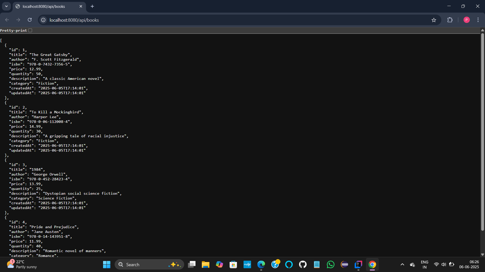
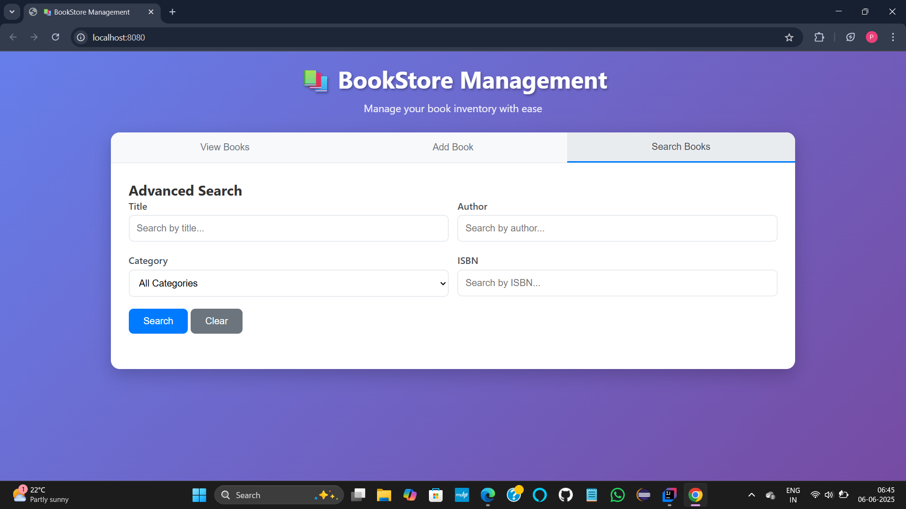
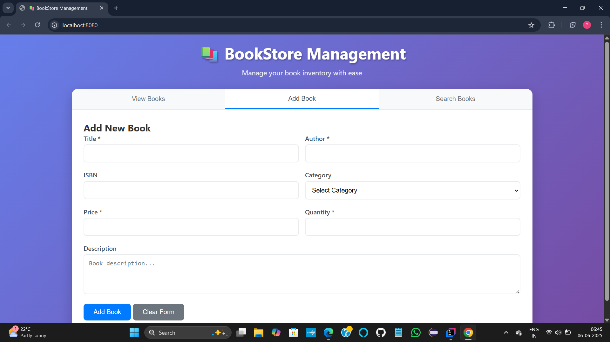
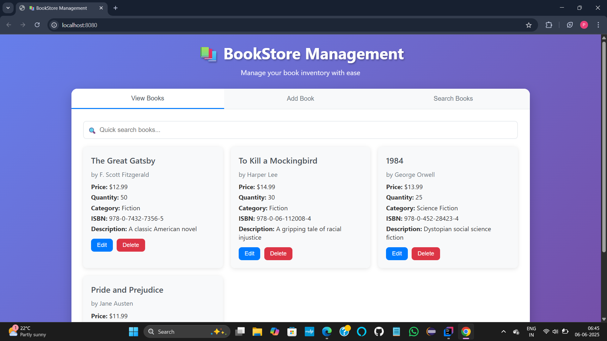

# 📚 BookStore Application

A full-stack BookStore web app built using Java (Spark Framework), JDBC, MySQL, HTML, CSS, and JavaScript.

---

## 🚀 Features

* RESTful API to manage books
* MySQL database integration
* Clean frontend using vanilla HTML, CSS, and JS
* LocalDateTime support with Gson
* Lightweight and framework-free full stack Java app

---

## 💠 Setup Instructions

### 1. Clone the Repository

```bash
git clone https://github.com/prishamehta01/BookStore.git
cd BookStore
```

### 2. MySQL Database Setup

* Create a database named `bookstore` (or your choice)
* Create the `books` table:

```sql
CREATE TABLE books (
    id INT AUTO_INCREMENT PRIMARY KEY,
    title VARCHAR(255) NOT NULL,
    author VARCHAR(255) NOT NULL,
    published_date DATETIME
);
```

* Update your MySQL credentials in `DatabaseConnection.java`:

```java
private static final String URL = "jdbc:mysql://localhost:3306/bookstore";
private static final String USER = "your_username";
private static final String PASSWORD = "your_password";
```

### 3. Build & Run the App

* Open the project in **IntelliJ IDEA Community Edition**
* Run `BookStoreApp.java`
* Backend will start at: `http://localhost:8080`

### 4. Use the Frontend

* Open `index.html` in a browser to interact with the API

---

## 🔗 API Endpoints

| Method | Endpoint     | Description    |
| ------ | ------------ | -------------- |
| GET    | `/api/books` | Get all books  |
| POST   | `/api/books` | Add a new book |

**Sample POST JSON Body:**

```json
{
  "title": "The Alchemist",
  "author": "Paulo Coelho",
  "publishedDate": "2024-06-01T00:00:00"
}
```

---

## 📸 Screenshots







### 🔍 Home Page




---

## 🙌 Acknowledgements

Developed by **Prisha Mehta** 🚀
If you like this project, feel free to ⭐ star the repo and share it!
